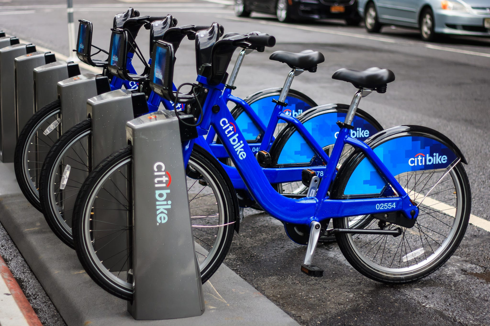

# Latar Belakang

Sistem berbagi sepeda adalah generasi baru dari persewaan sepeda tradisional yang seluruh prosesnya, mulai dari keanggotaan, penyewaan, dan pengembalian, menjadi otomatis. Melalui sistem tersebut, pengguna dapat dengan mudah menyewa sepeda dari posisi tertentu dan kembali lagi pada posisi lain. Saat ini, terdapat sekitar lebih dari 500 program berbagi sepeda di seluruh dunia yang terdiri dari lebih dari 500 ribu sepeda. Saat ini, terdapat minat yang besar terhadap sistem ini karena peran pentingnya dalam masalah lalu lintas, lingkungan, dan kesehatan.Terlepas dari penerapan sistem berbagi sepeda di dunia nyata yang menarik, karakteristik data yang dihasilkan oleh sistem ini menjadikannya menarik untuk penelitian. Berbeda dengan layanan transportasi lain seperti bus atau kereta bawah tanah, durasi perjalanan, keberangkatan, dan posisi kedatangan dicatat secara eksplisit dalam sistem ini. Fitur ini mengubah sistem bike sharing menjadi jaringan sensor virtual yang dapat digunakan untuk mendeteksi mobilitas dalam kota. Oleh karena itu, peristiwa-peristiwa terpenting di kota tersebut diharapkan dapat dideteksi dengan memantau data ini

# Pernyataan Masalah

Dengan permintaan penggunaan bike sharing yang terus meningkat, penempatan ketersedian sepeda yang stabil disetiap lokasi menjadi hal yang sangat diperhitungkan. Bila mana ketersedian disuatu lokasi tidak seimbang dengan perminat pengguna sepeda, maka para pesepeda akan menunggu waktu hingga ketersedian sepeda tersedia kembali, kondisi seperti ini akan membuat para pesepeda mencari alternatif lain seperti menggunakan transpotasi lain sehingga kondisi ini akan mengurangi pendapatan penyedia. sedangkan jika menempatkan sepeda yang lebih banyak disuatu lokasi yang kurang efektif akan juga berdampak bagi pengeluaran biaya yang tinggi. oleh karena itu **permintaan dari para pesepeda harus diimbangi dengan tingkat ketersedian sepeda disetiap lokasi yang akan dipertimbangkan dari segi waktu dan kondisi, sehingga penyedia dapat menyediakan kapasitas sepeda yang cukup saat dibutuhkan dan mengurangi ketersedian sepeda pada suatu lokasi yang kurang efektif.**

# Dataset

Untuk menjawab peryataan permasalah diatas, kami akan menganalisa data Bike Sharing yang dikumpulkan oleh perusahan. Data dapat diakses <a href='https://drive.google.com/drive/folders/17Mw_4wSRiBB5vLLQJN137AlAbyB3CLFx'>disini.</a>

# Goals

Berdasarkan permasalahan tersebut, penyedia bike sharing perlu memiliki prediksi tolls **guna memprediksi jumlah pengguna bike share pada lokasi dan kondisi tertentu seperti mempertimbangkan cuaca, hari , musim dan lainya**. Harapanya dengan adanya prediksi tolls ini dapat membantu penyedia sepeda untuk menempatkan sepeda-sepeda ke lokasi yang lebih efektif hall ini juga akan meningkatkan potensi pedapatan penyedia dan kepercayaan terhadap pengguna layanan bike share.

# Installation

To get this project, you can clone it by running the following code:

    https://github.com/muhammadtofikhidayat/Predict_Demand_Bike_Sharing_NYC

# Project Organization

The directory structure of capstone project 3 looks like this:

      |── Readme.md
      ├── data
      │   └── bike_sharing.csv
      ├── requirements.txt
      ├── src
          └── script.ipynb

# Contribute

Jika anda ingin berkontribusi lebih lanjut bisa langsung ke github saya sebagai berikut https://github.com/muhammadtofikhidayat/Predict_Demand_Bike_Sharing_NYC, atau bisa langsung menghubungi kontak saya.
